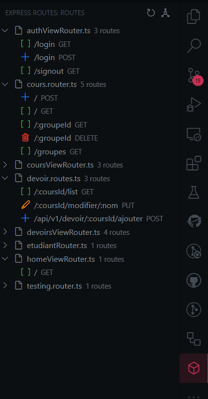
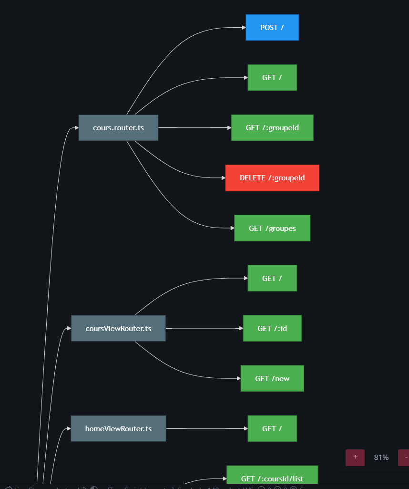

# Express Routes Viewer

{ width=25% }

A VS Code extension that displays all your Express.js routes in a tree view or a graph view!





## Features

- Lists all Express.js routes found in your project
- Shows HTTP method and full path for each route
- Click on a route to go to its definition
- Supports both Express router-style and decorator patterns
- Configurable file patterns and exclusions

## Supported Route Definitions

### Express Router Style
```javascript
app.get('/users', ...)
router.post('/users', ...)
```

### Decorator Style (e.g., NestJS, routing-controllers)
```typescript
@Controller('/api')
class UserController {
    @Get('/users')
    getUsers() {}

    @Post('/users')
    createUser() {}
}
```

## Configuration

- `expressRoutesViewer.includePattern`: Glob pattern for files to search (default: "**/*.{js,ts}")
- `expressRoutesViewer.excludeFolders`: Folders to exclude (default: ["node_modules", "dist", "build"])
- `expressRoutesViewer.sortBy`: Sort routes by "method", "path", or "file" (default: "path")

## Usage

1. Open your Express.js project in VS Code
2. Click the Routes icon in the Activity Bar
3. View all your routes in the side panel
4. Click the refresh button to update the route list
5. Click on a route to go to its definition
6. Click on the top-right icon to open a graph view of your routes

The extension automatically detects routes defined using Express router methods and method decorators.

You can configure the file patterns and exclusions in the settings.

## Known Issues

- Does not make a distinction between different projects if you have multiple Express.js projects open in the same workspace
- Routes defined as regular Express.js routes are not fully showing the path with prefixes (e.g., `app.use('/api', router)` + `router.get('/users')` will show `/users` instead of `/api/users`)

## Release Notes

- Initial release of the extension featuring route viewing capabilities.
- Added support for viewing routes as a graph.
- Added support for both Express router-style and decorator patterns.
- Added configuration options for file patterns and exclusions.
- Added sorting options for routes.
- Added refresh button to update the route list.
- Support TypeScript and JavaScript files.

## License

This project is licensed under the MIT License - see the [LICENSE](LICENSE) file for details.

---